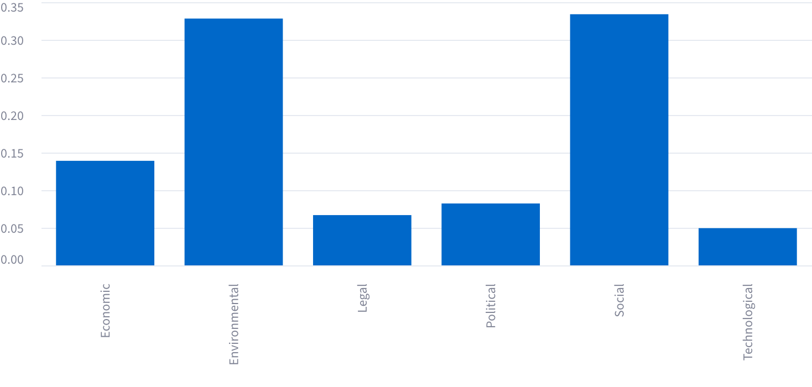

# Statistical Looks
🏫 School: School of Science  21%
│
├── 🎓 Program: MA  30%
│
├----── 📘 Course: Strategic Management  23%
│          └─ Dewey Decimal: 658.4
│
├--------── 🎯 Specialization: Sustainable Business  63%
│
└------------── 📊 Estimated Grade Level: High School
                   └─ Flesch-Kincaid score: 10.8

# Esmated Personality 

# PESTLE analysis 

# Data Theft Perspective [ Don’t insist on his territory ]

# Linguistics or Analogy 
## Given texts

Rahman rahim excellencies Mr. former president Mr. Boris former prime minister Mosa uh ministers distinguish guest ladies and gentlemen asalam alaikum and a very good morning. I thank the center for governance studies for organizing way of Bengal conversation 2026. Bangladesh has newly elected government with an overwhelming public mandate. We have a five-year program to deliver on the mandate. Our priorities are national interest, policy continuity, economic stability and institutional reform. We are now moving from commitment to implementation. We are making Bangladesh an attractive destination for investment. We are building Bangladesh as a strong manufacturing and investment hub. We seek more jobs in production, service, export and all sectors. Investors need certaintity. So our policy continuity will guide that. Ladies and gentlemen, our social protection programs are targeting those who need it the most. The family card will provide financial support to the mother of every family starting with the poorest and most vulnerable. The farmers card will connect farmers with incentives, services and markets. The health card will ensure medical access to all and ultimately the universal card will provide everyone an integrated exposure to public service. This ring guest healthcare must reach every household. We are working to employ 100,000 health workers. Around 80% of them will be women. They will provide basic care, health advice and referral at community level. We are also focusing on maternal and child healthcare. I believe education must prepare students for life not only for certificates. We are al we are promoting learning with happiness culture sports values and principles in curriculums. We'll have an important [clears throat] role to build our children's characters. They will also have an opportunity to learn third language. Technical and vocational education will expand alongside general education. Our government will provide free uniforms, school bags, midday meals and scholarships. Starting from class one, we are expanding free education for girls up to graduation level. Excellencies and ladies and gentlemen, our young population is a major national asset. But such a demographic dividend requires skills and jobs. We are embracing technological changes and artificial intelligence while promoting language skills and employment pathways. We are supporting innovation, entrepreneurship and startups. We want our youth to complete globally and turn brain drain into brain circulation. Agriculture remains central to our in economy. We are improving access to technology, irrigation, finance and markets. We are supporting fisheries, livestock and rural enterprise enterprises. Food security must complement the agroprocessing and export industries. Because I believe a stronger rural economy means a stronger Bangladesh. Distinguished guests and ladies and gentlemen, water security is equally very important. Over the next 5 years, we plan to dig 20,000 kilometers of canels and waterways. We are advancing the Padma parish project for water retention and management. We are developing a Tista master plan. These measures will support agriculture and build climate resilience. Our environmental targets are concrete. We will plant 250 million trees in 5 years inshallah. We are expanding solar energy. Bangladesh is promoting waste recycling and green factories with 53 of the world's top 100 lead certified factories. Clean and green cities can reduce waste, foster climate resilience and boost our economy. Excellencies, ladies and gentlemen, development also requires strong institution. We are strengthening transparency and accountability. Human rights, democratic principles and freedom of expression must be protected. The rule of law must apply equally to every citizen. We will create a culture where public institution truly serve the people of Bangladesh. Bangladesh is also fulfilling a major global responsibility. We continue to host around 1.3 million Rohhinga refugees. Our objective remains their early voluntary, safe, dignified and sustainable repatriation to Myanmar. This requires sustained political support and global finance. It also requires addressing the root cause of the crisis which started in Myanmar and must end in Myanmar. The Bay of Bengal shapes our fate generation after generations. The strategic location of Bangladesh also means our ports, waterways and coastal economy can connect to the wider world. There are opportunities in shipping, fisheries, tourism, energy and regional supply chains. Regionally, our shared geography should become a shared prosperity and that requires deeper bilateral and multilateral engagement. We can expand trade, energy, education, technology, climate, and maritime collaboration. We can open new markets and create more opportunities for our young people. We can build stronger cooperation based on equality, fairness, and justice. Geography has brought us together and we are confident that people-to-people ties can take us farther. Bangladesh believes in dialogue, partnership and mutual respect. We will protect our national interest and sovereignty. At the same time, we will work positively with all our regional and global partners because peace and harmony are the foundation of shared prosperity and development which we believe very strongly. Let the Bay of Bengal become a region where nations grow together, embrace mutual and reciprocal benefits and citizen expand meaningful cooperation. Bangladesh is ready to play its part. I thank you all. Have a good day. Allah

## Truth tables

# Let’s go for conclusion 

# Recommended meal 

